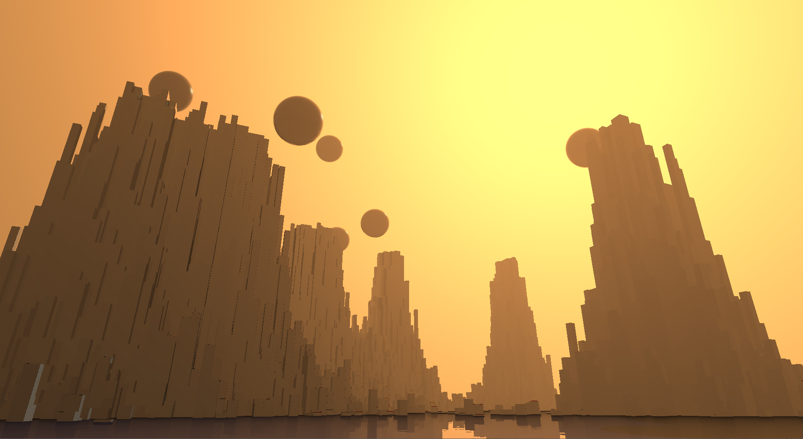

# ochre
This is the full source code for [ochre](https://www.pouet.net/prod.php?which=85924) 4K intro. All code is pure Rust and glsl. Please do not use this code to learn how to write *good* Rust code but you can use it to learn how to write code that compiles very *small*.

 

A more detailed explanation about the different size optimizations can be found [here](https://www.codeslow.com/2020/07/writing-winning-4k-intro-in-rust.html)

## For easier development
During development use following to enable loading shader from shader.glsl and have movable camera and logs
```
 xargo run --target i686-pc-windows-msvc --features logger
```

## For the release version

First compile release version 
```
 xargo rustc --release --target i686-pc-windows-msvc -- --emit=obj
``` 

Then use crinkler to compress ( the precise path to the windows sdk will depend on your version )
```
 ..\..\..\..\..\tools\crinkler /OUT:mini.exe /SUBSYSTEM:WINDOWS miniwin.o /ENTRY:mainCRTStartup "/LIBPATH:C:\Program Files (x86)\Windows Kits\10\Lib\10.0.18362.0\um\x86" gdi32.lib user32.lib opengl32.lib kernel32.lib winmm.lib
 ```

To analyze the compiled assembly code run
 ```
  xargo rustc --release --features fullscreen --target i686-pc-windows-msvc -- --emit=asm
```

The glsl shader is compressed by the minifier using the command line
```
.\tools\shader_minifier.exe .\shader.glsl --preserve-externals --format none
```
This will create the the file ```shader_code.h``` from where you need to manually copy and paste the minified code into ```shader.rs```
